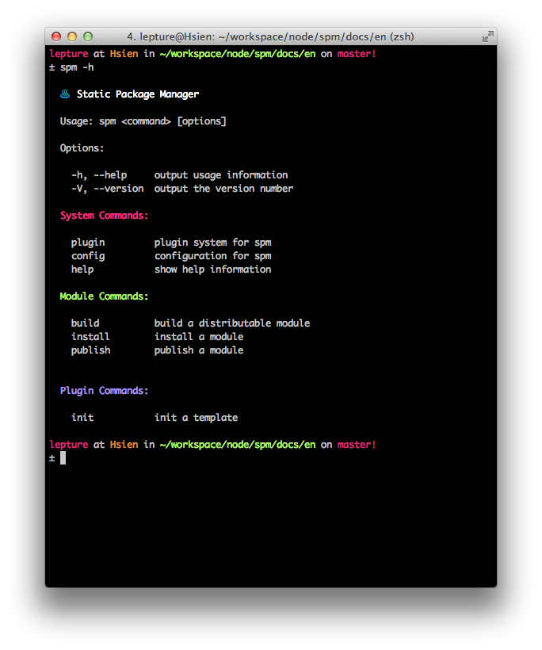

# spm

spm is a static package manager, it's **not a build tools**.

------

spm is built on nodejs, which means you have to install nodejs yourself.
I believe you have done this part, but I'd like to repeat myself.

There are several ways to install nodejs. The easiest way is through a package manager like `apt-get` on debian-like linux distribution, or `homebrew` on mac. However node in such package managers may be too old.

Get the node binaries on the offical [download](http://nodejs.org/download/) webpage.

Suggestions for Linux:

- grab the *Linux Binaries*, extract it to your home directory, for example: `~/dist/node`

- add `~/dist/node/bin` to `PATH` in your bashrc or zshrc:

   ```
   export PATH="$PATH:$HOME/dist/node/bin"
   ```

- add `~/dist/node/lib/node_modules` to `NODE_PATH` in your bashrc or zshrc:

   ```
   export NODE_PATH="$HOME/dist/node/lib/node_modules
   ```

Putting node in your home directory or some place need no sudo privellege makes things simple. You don't have to `sudo npm install <package>` anymore.

Suggestions for Mac:

- just like Linux, you can do the same thing.
- homebrew is another good choice.
- don't forget to add `NODE_PATH` environment variable in your bashrc or zshrc.

Suggestions for Windows:

- do whatever you want, I don't think there is another choice.
- don't forget to add `NODE_PATH` environment variable, it should be:

   ```
   NODE_PATH = C:\Users\{{username}}\AppData\Roaming\npm\node_modules
   ```


## Installation

Install spm is simple with npm:

    $ npm install spm -g

Please install it with `-g` option, otherwise you can't use it in command line.

If you want to try the latest version of spm, try the ninja channel:

    $ npm install spm@ninja -g

You can also grab the code from [github](https://github.com/spmjs/spm2) and install from the source code.


## Commands

spm comes with some built-in commands, and it can be extended by plugins. Show the help screen with:

    $ spm -h

or:

    $ spm help



You can get more help information of a sub-command by:

    $ spm build -h

or:

    $ spm help build

Want to write your own plugin? Checkout the [plugin](./plugin.md) section.

## Build